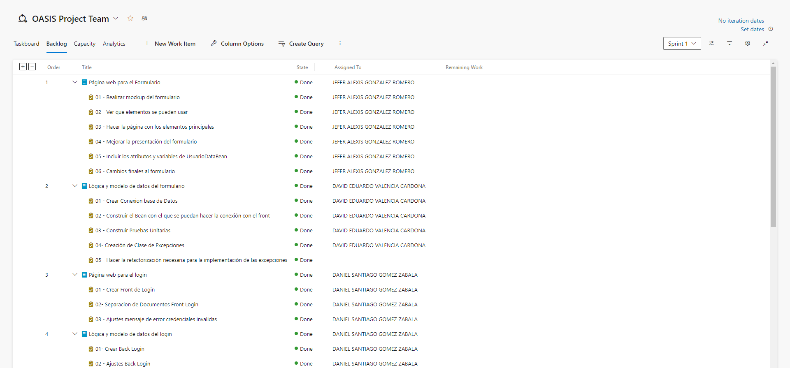
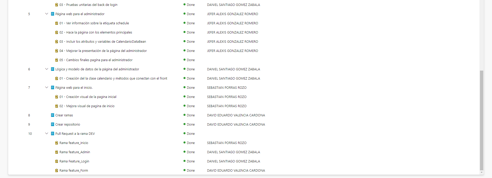
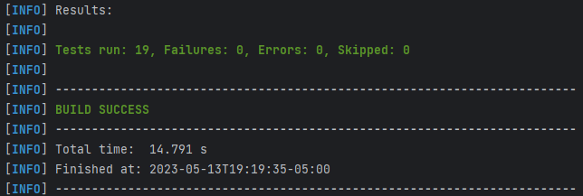
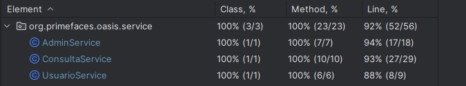

# Proyecto Final - OASIS

Realizaremos una aplicación web (MVP) para solucionar un problema de un cliente real, el cual en esta ocasión se trata de una página que permita el agendamiento de citas y la administración de estas por parte del personal designado para ello, habra un formulario el cual recopilará toda la información del cliente junto a su firma, donde este recibira una confirmación via correo electronico del agendamiento. Una vez agendada el administrador podra ver la información de esta en su portal, donde podra tener control, cambiar el estado y agregar observaciones a la cita respectiva.

**Curso** 

- **C**iclos de **V**ida del **D**esarollo de **S**oftware (CVDS)

**Integrantes**
- Daniel Santiago Gomez Zabala *(Equipo Scrum)*
- Jefer Alexis González Romero *(Scrum Master)*
- Sebastian Porras Rozo *(Equipo Scrum)*
- David Eduardo Valencia Cardona *(Equipo Scrum)*

**Profesor**

- Ivan Dario Lemus Moya *(Product Owner)*

### Stack Tecnológico
 - JSF 2.2.
 - Primefaces 12.
 - Spring Framework.
 - Spring Data for MySQL/H2.
 - Omega Template - Basic License (for not paid projects).

### Documentación de la plantilla
[Documentacion](https://www.primefaces.org/omega/documentation.xhtml)

### Iniciar proyecto.
Se debe ejecutar el siguiente comando:
` mvn spring-boot:run`

## Descripción del proceso

### [Enlace al backlog de AzureDevops](https://dev.azure.com/AlexisGR117/OASIS%20Project/_backlogs/backlog/OASIS%20Project%20Team/Backlog%20items)

### Sprints - Backlog

#### Sprint 1

### Reporte de pruebas

Pruebas realizadas para las clases *Service*

### Cubrimiento de pruebas

